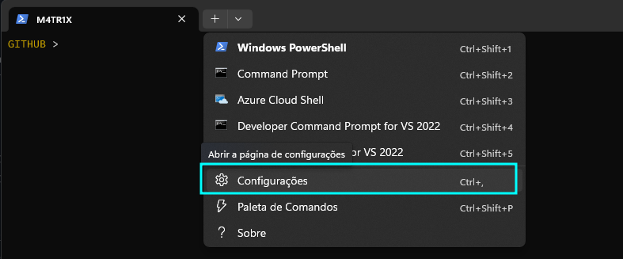

<p align="center">
    
</p>

---


---

O Windows Terminal é um aplicativo de terminal moderno desenvolvido pela Microsoft para sistemas operacionais Windows. Ele fornece uma interface de linha de comando avançada e suporta múltiplas abas e perfis, permitindo que os usuários acessem e gerenciem diferentes shells e ambientes de linha de comando em uma única janela.

---

## Instalação

Podemos baixar o programa pela própria Microsoft Store em qualquer Windows após o 10, onde ele já vem instalado no Windows 11.

## Configuração

Windows terminal é extremamente configurável e podemos mudar tudo que quisermos!

Por padrão o Powershell é o tipo de sistema principal iniciado junto com o Windows Terminal, onde podemos pelo Windows Terminal configurar como quisermos o nosso Powershell.

Podemos acessar as configurações pela seta de `+` e selecionarmos _Configurações_ ou pelo caminho <kbd>Ctrl</kbd> + <kbd>,</kbd>

<p align="center">
    
</p>

### Definindo o tema do Windows Terminal

<p align="center">
    
</p>

### Configurando o Powershell

Vou mostrar como configurei meu powershell!

<p align="center">
    
<p>

1. Acesse o Perfil do Powershell pelas configurações do Windows Terminal
2. A `Linha de Comando` é como vai ser iniciado o powershell no terminal, onde se colocarmos o atributo $\sf \color{lightblue} -nologo$ ele evita de iniciar o powershell com a mensagem padrão inicial.
3. Podemos colocar o diretório inicial que vai ser iniciado o powershell, no meu caso já acesso o diretório onde se encontra todos os meus projetos do Github.
4. Podemos colocar um nome do terminal como quisermos, por isso o terminal inicial começa com o nome `M4TRIX`


Tem mais configurações adicionais que podem ser colocados, onde iremos acessar a opção `Aparência`

<p align="center">
    
<p>

Na área de aparência, podemos mudar cores, fontes e forma de escrever no terminal, como mostra abaixo:

<p align="center">
    
<p>

2. Coloquei a fonte `Fira Code` que baixei da internet por ser uma fonte muito boa para consoles, deixarei as fontes nesse repositório para baixarem no windows.
3. Alterei o tamanho da fonte para 10
4. A fonte é do tipo normal, deixando ela mais fina e elegante
5. Todas essas informações podem ser alteradas pelo arquivo JSON do windows terminal.

<p align="center">
    
<p>

### Configurando o PS1 do Powershell

Podemos configurar os dados que aparecem no Powershell, onde podemos encontrar a localização do arquivo de configuração do powershell pelo comando $\sf \color{lightgreen} profile$

```powershell
$profile
```

Minha configuração do Powershell é mostrar somente o diretório atual e ter as informações do GIT junto para saber em qual branch estou e seu status com a branch oficial no origin


```powershell
function prompt {
    $gitStatus = & git status -s -b 2>$null
    #$user = "$env:USERNAME"
    $dir = (Get-Location).Path | Split-Path -Leaf
    
    if ($gitStatus) {
        $branch = ($gitStatus -split "`n" | Select-String -Pattern "##")[0] -replace "## "
        $gitInfo = " [$branch]"
    } else {
        $gitInfo = ""
    }
    
    [char]27 + "[33m" + $dir + [char]27 + "[32m" +  $gitinfo + [char]27 + "[0m" + " > "
}
```

### Iniciando o powershell por scripts

Podemos iniciar o Windows Terminal pelo `Executar` ativando pelo comando <kbd>Windows</kbd> + <kbd>R</kbd>

Com o seguinte comando o Windows terminal inicia em tela cheia e com o powershell sem a logo inicial e sem fechar sozinho

```shell
wt --fullscreen Powershell.exe -NoLogo -NoExit
```

<p align="center">
    
</p>

Podemos também iniciar com o powershell com um título específico

```powershell
wt --fullscreen Powershell.exe -NoLogo -NoExit -Command "$host.UI.RawUI.WindowTitle = 'Jarbas'"
```

## Comandos de Teclado com o Windows Terminal


## Emojis no Windows Terminal

## Como iniciar Windows Terminal pelo Startup

Podemos criar um arquivo `.bat` com o comando de inicio do terminal ou algum projeto específico, como por exemplo:

```powershell
start "" "C:\Program Files\Flameshot\bin\flameshot.exe"
```

Acessamos a página onde colocar esse arquivo pelo Executar colocando o comando `shell:startup`

<p align="center">
    
</p>

Assim qualquer comando que precisa ser rodado no console vai ser ativado quando o computador iniciar!